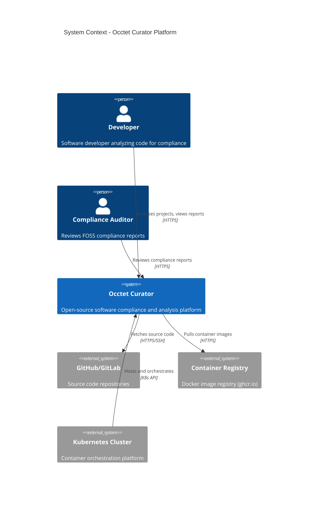
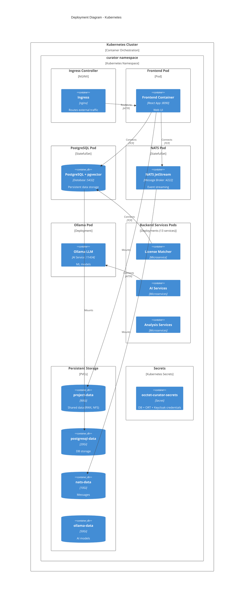
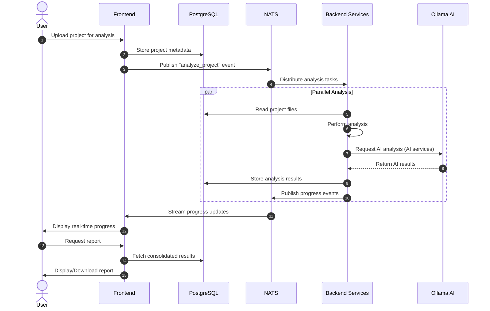

# Occtet Curator Helm Chart

This Helm chart deploys the complete Occtet Curator application on Kubernetes, including the frontend web interface and all backend microservices.

- [Occtet Curator Helm Chart](#occtet-curator-helm-chart)
  - [Overview](#overview)
  - [Prerequisites](#prerequisites)
  - [Security Considerations](#security-considerations)
    - [Creating Kubernetes Secrets](#creating-kubernetes-secrets)
      - [Unified Credentials Secret](#unified-credentials-secret)
      - [Optional: CA Certificates](#optional-ca-certificates)
      - [Verifying Secrets](#verifying-secrets)
  - [Quick Start](#quick-start)
    - [Installation (Complete Setup)](#installation-complete-setup)
    - [Installation](#installation)
    - [Quick Command Reference](#quick-command-reference)
  - [Deployed Components](#deployed-components)
    - [Core Services](#core-services)
    - [Backend Microservices (13 Services)](#backend-microservices-13-services)
  - [Configuration](#configuration)
    - [Key Parameters](#key-parameters)
    - [PostgreSQL Configuration](#postgresql-configuration)
    - [Updating Dependencies](#updating-dependencies)
      - [Update PostgreSQL Version](#update-postgresql-version)
      - [Manual PostgreSQL Configuration (NOT RECOMMENDED)](#manual-postgresql-configuration-not-recommended)
    - [Ingress Configuration](#ingress-configuration)
    - [Disabling Optional Services](#disabling-optional-services)
    - [Resource Customization](#resource-customization)
  - [Container Images](#container-images)
  - [Persistent Storage](#persistent-storage)
  - [Upgrade](#upgrade)
    - [Rotating Passwords](#rotating-passwords)
  - [Uninstallation](#uninstallation)
    - [Cleanup Options](#cleanup-options)
  - [Troubleshooting](#troubleshooting)
    - [Check Pod Status](#check-pod-status)
    - [View Logs](#view-logs)
    - [Database Connection](#database-connection)
    - [Port Forwarding for Local Access](#port-forwarding-for-local-access)
    - [Restart Services](#restart-services)
    - [Common Issues](#common-issues)
  - [Architecture](#architecture)
    - [C4 Model - System Context](#c4-model---system-context)
    - [C4 Model - Container Diagram](#c4-model---container-diagram)
    - [C4 Model - Deployment Diagram](#c4-model---deployment-diagram)
    - [Communication Flow](#communication-flow)
  - [Development](#development)
    - [Available Make Commands](#available-make-commands)
    - [Testing Changes](#testing-changes)
    - [Package Chart](#package-chart)
  - [Make Command Reference](#make-command-reference)
    - [Setup \& Chart Lifecycle](#setup-chart-lifecycle)
    - [Installation \& Upgrade](#installation-upgrade)
    - [Secrets Management](#secrets-management)
    - [Status \& Inspection](#status-inspection)
    - [Logs](#logs)
    - [Port Forwarding](#port-forwarding)
    - [Shell Access](#shell-access)
    - [Restart \& Scale](#restart-scale)
    - [Cleanup](#cleanup)
  - [Support \& Documentation](#support-documentation)
  - [License](#license)


## Overview

Occtet Curator is a comprehensive open-source software compliance and analysis platform that provides:
- License detection and matching
- Copyright filtering and analysis
- SPDX and CycloneDX document generation and export
- Vulnerability scanning
- FOSS (Free and Open Source Software) reporting
- AI-powered copyright and license analysis

## Prerequisites

- Kubernetes 1.19+
- Helm 3.0+
- Make (for simplified deployment)
- `kubectl` and `jq` (used by the `secrets-*` targets)
- PersistentVolume provisioner support in the underlying infrastructure
- At least 200Gi of available storage (configurable)
- Minimum 8 CPU cores and 16Gi RAM for full deployment

**Note**: All deployment commands in this guide use `make` for simplicity. See `make help` for all available commands.

## Security Considerations

**IMPORTANT**: This Helm chart requires secure management of sensitive credentials. All passwords must be stored in Kubernetes secrets, not in values.yaml files.

### Creating Kubernetes Secrets

Before installing the chart, create the required secrets:

#### Unified Credentials Secret

A **single** secret named `occtet-curator-secrets` holds every credential: PostgreSQL,
ORT (OSS Review Toolkit) and Keycloak. It is referenced by
`postgresql.auth.existingSecret`, `postgresql.customUser.existingSecret` and
`frontend.existingSecret` in `values.yaml`.

| Key | Used for | Consumed by |
|-----|----------|-------------|
| `username` | PostgreSQL application user | frontend + all backend services (`DB_USERNAME`) |
| `postgres-password` | PostgreSQL password (superuser and application user) | frontend + all backend services (`DB_PASSWORD`) |
| `database` | PostgreSQL database name | `postgresql.customUser` (created at initdb) |
| `ort-username` | ORT Server user | frontend + services with `useOrtCredentials` |
| `ort-password` | ORT Server password | frontend + services with `useOrtCredentials` |
| `keycloak-client-id` | Keycloak client ID | frontend |
| `keycloak-client-secret` | Keycloak client secret | frontend + services with `useOrtCredentials` |

**Manual creation**

```bash
# Generate a secure random password
POSTGRES_PASSWORD=$(openssl rand -base64 32)

kubectl create secret generic occtet-curator-secrets \
  -n curator \
  --from-literal=username=curator \
  --from-literal=postgres-password="$POSTGRES_PASSWORD" \
  --from-literal=database=curator \
  --from-literal=ort-username=YOUR_ORT_USER \
  --from-literal=ort-password=YOUR_ORT_PASSWORD \
  --from-literal=keycloak-client-id=api-access \
  --from-literal=keycloak-client-secret=YOUR_KEYCLOAK_SECRET
```

**Alternative**: start from the template in
[examples/occtet-curator-secrets-example.yaml](examples/occtet-curator-secrets-example.yaml),
replace every placeholder value, then apply it:

```bash
kubectl apply -f occtet-curator-secrets.yaml -n curator
```

**WARNING**: never commit a filled-in secret file. `.gitignore` already excludes
`secrets.yaml`, `*-secret.yaml`, `*.secret.yaml` and `secrets-backup.yaml`.

#### Optional: CA Certificates

Services with `mountCaCerts: true` (`ortRunStart`, `processRun`) and the frontend mount
custom CA certificates from `frontend.caCerts.existingSecret` or
`frontend.caCerts.existingConfigMap`. Both default to `""`, in which case an `emptyDir`
is mounted and no custom CA is trusted.

#### Verifying Secrets

Check that the secret is created correctly:

```bash
# Using Make (requires jq)
make secrets-check

# Or manually
kubectl get secret occtet-curator-secrets -n curator
kubectl describe secret occtet-curator-secrets -n curator
```

## Quick Start

### Installation (Complete Setup)

**The secret must exist before installing** - the chart only references it, it never
creates it (see [Creating Kubernetes Secrets](#creating-kubernetes-secrets)).

```bash
# 1. Create the namespace
make namespace

# 2. Create the unified secret (see the section above)
kubectl apply -f occtet-curator-secrets.yaml -n curator
make secrets-check

# 3. Install the chart
make install
```

`make install` runs `namespace`, `deps` (fetch chart dependencies) and `lint` first, then
`helm install --wait --timeout 20m` using the chart's own `occtet-curator/values.yaml`.

### Installation

```bash
# Basic installation (chart defaults)
make install

# Or install with custom values
make install-custom VALUES=custom-values.yaml
```

**Note**: `make install` does **not** pass the repository-root `values.yaml`, while
`make upgrade` does. To install with those overrides, use
`make install-custom VALUES=values.yaml`.

### Quick Command Reference

```bash
# View all available commands
make help

# Check deployment status
make status

# View pods
make pods

# View logs
make logs-frontend
make logs-backend

# Port-forward to services
make port-forward-frontend    # Access at http://localhost:8090
make port-forward-postgresql  # Access at localhost:5432
```

## Deployed Components

### Core Services

- **Frontend**: Web user interface (port 8090)
- **PostgreSQL**: Primary database with pgvector extension for AI features (port 5432)
- **NATS**: Message broker with JetStream for service communication (ports 4222, 8222)
- **Ollama**: AI/LLM service for advanced analysis features (port 11434)

### Backend Microservices (13 Services)

1. **licensematcher-service**: License identification and matching
2. **ai-copyrightfilter-service**: AI-powered copyright detection and filtering
3. **copyrightfilter-service**: Traditional copyright filtering
4. **foss-report-service**: FOSS compliance report generation
5. **vulnerability-service**: Security vulnerability analysis
6. **ai-licensematcher-service**: AI-enhanced license matching
7. **spdx-service**: SPDX document management
8. **cyclonedx-service**: CycloneDX document management
9. **cyclonedx-export-service**: CycloneDX document export functionality
10. **download-service**: Package download and management
11. **spdx-export-service**: SPDX document export functionality
12. **ort-run-start-service**: ORT run triggering
13. **process-run-service**: ORT run result processing

## Configuration

### Key Parameters

| Parameter | Description | Default |
|-----------|-------------|---------|
| `global.namespace` | Kubernetes namespace | `curator` |
| `imageRegistry` | Container image registry | `ghcr.io/heurtematte` |
| `imageTag` | Global tag override for all images (empty = per-service tags) | `""` |
| `imagePullPolicy` | Global pull policy override (empty = per-service policy) | `""` |
| `frontend.enabled` | Enable frontend deployment | `true` |
| `frontend.service.type` | Service type (ClusterIP/LoadBalancer/NodePort) | `ClusterIP` |
| `frontend.ingress.enabled` | Enable Ingress for external access | `false` |
| `postgresql.enabled` | Enable PostgreSQL database | `true` |
| `nats.enabled` | Enable NATS message broker | `true` |
| `ollama.enabled` | Enable Ollama AI service | `true` |
| `nfsprovisioner.enabled` | Deploy the NFS provisioner (ReadWriteMany storage) | `true` |
| `persistence.projectData.enabled` | Enable persistent storage for project data | `true` |
| `persistence.projectData.size` | Project data volume size | `90Gi` |
| `persistence.projectData.accessMode` | Access mode for the shared volume | `ReadWriteMany` |

### PostgreSQL Configuration

**IMPORTANT**: Never store passwords directly in values.yaml. Always use Kubernetes secrets.

The chart uses the CloudPirates `postgres` chart with a `pgvector` image:

```yaml
postgresql:
  enabled: true
  image:
    registry: docker.io
    repository: pgvector/pgvector
    tag: pg17-trixie
  auth:
    # Superuser is 'postgres'; its password comes from the secret key postgres-password
    existingSecret: "occtet-curator-secrets"
  customUser:
    # Non-superuser application account created at initdb
    existingSecret: "occtet-curator-secrets"
    secretKeys:
      name: "username"
      password: "postgres-password"
      database: "database"
  persistence:
    enabled: true
    size: 20Gi
    storageClass: ""  # Use default storage class
  initdb:
    scriptsConfigMap: "{{ .Release.Name }}-postgresql-init"
```

**Note**: the username and database name are **not** set in `values.yaml` - they are read
from the `username` and `database` keys of the secret. See
[Unified Credentials Secret](#unified-credentials-secret) for the full key list.

### Updating Dependencies

#### Update PostgreSQL Version

To update the PostgreSQL chart version:

1. **Check current version**:
```bash
make deps-list
```

2. **Edit the Chart.yaml** file in [occtet-curator/Chart.yaml](occtet-curator/Chart.yaml).
   The chart has two dependencies; the PostgreSQL one is named `postgres` upstream and
   aliased to `postgresql`:
```yaml
dependencies:
  - name: postgres
    version: "0.20.4"  # Change this to the desired version
    repository: "oci://registry-1.docker.io/cloudpirates"
    condition: postgresql.enabled
    alias: postgresql
  - name: nfs-server-provisioner
    version: "1.8.0"
    repository: "https://kubernetes-sigs.github.io/nfs-ganesha-server-and-external-provisioner/"
    condition: nfsprovisioner.enabled
    alias: nfsprovisioner
```

3. **Update dependencies**:
```bash
make deps-update
```

4. **Upgrade the release** (if already installed):
```bash
make upgrade
```

#### Manual PostgreSQL Configuration (NOT RECOMMENDED)

The upstream `postgres` chart also accepts inline credentials when `existingSecret` is
empty:

```yaml
postgresql:
  auth:
    existingSecret: ""          # Leave empty to use inline passwords
    postgresPassword: "temporary-admin-password"  # CHANGE THIS
```

**WARNING**: this approach is insecure, is only acceptable in throwaway development
environments, and breaks the backend services - their `DB_USERNAME` / `DB_PASSWORD`
always read from `postgresql.customUser.existingSecret`, so the secret is still required.

### Ingress Configuration

To expose the frontend via Ingress with TLS:

```yaml
frontend:
  ingress:
    enabled: true
    className: nginx
    annotations:
      cert-manager.io/cluster-issuer: letsencrypt-prod
    hosts:
      - host: occtet-curator.example.com
        paths:
          - path: /
            pathType: Prefix
    tls:
      - secretName: occtet-curator-tls
        hosts:
          - occtet-curator.example.com
```

### Disabling Optional Services

AI services can be disabled to reduce resource requirements:

```yaml
backend:
  services:
    aiCopyrightfilter:
      enabled: false
    aiLicensematcher:
      enabled: false

ollama:
  enabled: false
```

### Resource Customization

Adjust resources based on your workload:

```yaml
frontend:
  resources:
    limits:
      cpu: 4000m
      memory: 8Gi
    requests:
      cpu: 1000m
      memory: 4Gi

backend:
  services:
    vulnerability:
      resources:
        limits:
          cpu: 2000m
          memory: 4Gi
        requests:
          cpu: 500m
          memory: 1Gi
```

## Container Images

All images are hosted on GitHub Container Registry. The registry is set by
`imageRegistry` (default `ghcr.io/heurtematte`) and the tag by the per-service
`image.tag`, unless `imageTag` overrides them globally:

- Frontend: `<imageRegistry>/occtet-frontend:<tag>`
- Backend services: `<imageRegistry>/occtet-nats-<service>-service:<tag>`

Backend image repositories: `occtet-nats-licensematcher-service`,
`occtet-nats-ai-licensematcher-service`, `occtet-nats-copyrightfilter-service`,
`occtet-nats-ai-copyrightfilter-service`, `occtet-nats-foss-report-service`,
`occtet-nats-vulnerability-service`, `occtet-nats-spdx-service`,
`occtet-nats-spdx-export-service`, `occtet-nats-cyclonedx-service`,
`occtet-nats-cyclonedx-export-service`, `occtet-nats-download-service`,
`occtet-nats-ort-run-start-service`, `occtet-nats-process-run-service`.

## Persistent Storage

The chart creates multiple PersistentVolumeClaims:

| PVC | Purpose | Default Size | Access Mode | Shared By |
|-----|---------|--------------|-------------|-----------|
| `project-data` | Project data and analysis results | 90Gi | ReadWriteMany | Frontend, `download-service` |
| `postgresql-data` | PostgreSQL database | 20Gi | ReadWriteOnce | PostgreSQL |
| `nats-data` | JetStream message storage | 10Gi | ReadWriteOnce | NATS |
| `ollama-data` | AI models and cache | 50Gi | ReadWriteOnce | Ollama |

`project-data` requires **ReadWriteMany**. By default the chart deploys
`nfs-server-provisioner` (`nfsprovisioner.enabled: true`), which creates an `nfs`
StorageClass backed by its own 100Gi ReadWriteOnce PVC - `project-data` (90Gi) is carved
out of it. Set `nfsprovisioner.enabled: false` and point
`persistence.projectData.storageClass` at your own RWX class to use an existing one.

**Total default storage**: ~180Gi (100Gi NFS backing + 20Gi + 10Gi + 50Gi)

## Upgrade

```bash
# Upgrade (uses the repository-root values.yaml)
make upgrade

# Upgrade with another values file
helm upgrade occtet-curator ./occtet-curator \
  --install --namespace curator --values custom-values.yaml
```

### Rotating Passwords

There is no automated rotation target. Rotate manually:

1. Back up the current secret (contains base64 passwords, keep it safe):
```bash
make secrets-backup
```

2. Generate a new password and patch the secret, keeping every other key unchanged:
```bash
NEW_PASSWORD=$(openssl rand -base64 32)

kubectl patch secret occtet-curator-secrets -n curator \
  -p "{\"stringData\":{\"postgres-password\":\"$NEW_PASSWORD\"}}"
```

3. Change the password inside PostgreSQL itself (patching the secret does not do it):
```bash
make shell-postgresql
# then, in psql:
#   ALTER USER curator WITH PASSWORD '<new password>';
#   ALTER USER postgres WITH PASSWORD '<new password>';
```

4. Restart the frontend and all backend services so they pick up the new value:
```bash
make restart-all
```

## Uninstallation

```bash
# Uninstall the chart (keeps PVCs and secrets)
make uninstall
```

**Important**: PersistentVolumeClaims and Secrets are not automatically deleted.

### Cleanup Options

```bash
# Delete PVCs (destroys all data)
make clean-pvcs

# Delete secrets (destroys credentials)
make secrets-delete

# Complete cleanup (chart + PVCs + secrets)
make clean-all

# Delete namespace and all resources
kubectl delete namespace curator
```

**WARNING**: `make clean-all` will permanently delete all data and credentials. Make sure to backup secrets if needed (`make secrets-backup`).

## Troubleshooting

### Check Pod Status

```bash
# Using Make
make pods

# Or manually
kubectl get pods -n curator
kubectl describe pod <pod-name> -n curator
```

### View Logs

```bash
# Using Make (recommended)
make logs-frontend
make logs-postgresql
make logs-nats
make logs-vulnerability
make logs-backend  # All backend services

# Specific backend service logs
kubectl logs -n curator -l app.kubernetes.io/service=vulnerability-service --tail=100 -f

# PostgreSQL logs
kubectl logs -n curator -l app.kubernetes.io/component=postgresql --tail=100 -f

# NATS logs
kubectl logs -n curator -l app.kubernetes.io/component=nats --tail=100 -f

# Frontend logs
kubectl logs -n curator -l app.kubernetes.io/component=frontend --tail=100 -f
```

### Database Connection

```bash
# Using Make
make shell-postgresql

# Or manually, using the credentials stored in the secret
DB_USER=$(kubectl get secret occtet-curator-secrets -n curator -o jsonpath='{.data.username}' | base64 -d)
DB_NAME=$(kubectl get secret occtet-curator-secrets -n curator -o jsonpath='{.data.database}' | base64 -d)
kubectl exec -it -n curator statefulset/occtet-curator-postgresql -- psql -U "$DB_USER" -d "$DB_NAME"
```

**Note**: `make shell-postgresql` hardcodes `-U occtetuser -d occtet_boc`. If your secret
uses different values (the example uses `curator`/`curator`), use the manual command above.

### Port Forwarding for Local Access

```bash
# Using Make (recommended)
make port-forward-frontend    # Access at: http://localhost:8090
make port-forward-postgresql  # localhost:5432
make port-forward-nats        # localhost:4222

# Or manually
kubectl port-forward -n curator svc/occtet-curator-frontend 8090:8090
kubectl port-forward -n curator svc/occtet-curator-postgresql 5432:5432
```

### Restart Services

```bash
# Restart specific components
make restart-frontend
make restart-backend

# Restart all services
make restart-all
```

### Common Issues

**Helm Upgrade/Install Timeout**

If `make upgrade` or `make install` exceeds the timeout (default: 20 minutes), this is usually caused by:

1. **PostgreSQL taking too long to start** (PVC provisioning + init scripts):
   ```bash
   # Check PostgreSQL pod status
   kubectl get pods -n curator -l app.kubernetes.io/name=postgresql
   kubectl logs -n curator -l app.kubernetes.io/name=postgresql --tail=100
   ```

2. **Multiple services waiting for dependencies**:
   ```bash
   # Monitor all pods in real-time
   make watch-pods
   
   # Check which pods are not ready
   make pods-not-ready
   ```

3. **Resource constraints** (not enough CPU/memory):
   ```bash
   # Check node resources
   kubectl top nodes
   kubectl describe nodes
   ```

**Solutions:**
- Deploy without waiting, then monitor manually:
  ```bash
  helm upgrade occtet-curator ./occtet-curator \
    --install --namespace curator --values values.yaml
  make watch-pods
  ```
- Increase the timeout by editing the `install` target in the Makefile (currently 20m)
- Disable optional services in `values.yaml`:
  ```yaml
  ollama:
    enabled: false
  backend:
    services:
      aiCopyrightfilter:
        enabled: false
      aiLicensematcher:
        enabled: false
  ```
- Check logs for specific issues:
  ```bash
  make logs-postgresql
  make logs-backend
  make describe-pods
  ```

**Pods stuck in Pending**
```bash
# Check PVCs and storage
make pvcs
kubectl get storageclass
```

**ImagePullBackOff errors**
```bash
# Check pods status
make pods
```

**Service connection issues**
```bash
# Check logs
make logs-nats
make logs-postgresql

# View all resources
make all-resources
```

**Secret issues**
```bash
# Verify secrets exist
make secrets-check

# View secret details
make secrets-view
```

## Architecture

### C4 Model - System Context



### C4 Model - Container Diagram

```mermaid
C4Container
    title Container Diagram - Occtet Curator

    Person(user, "User", "Developer or auditor")
    
    Container_Boundary(curator, "Occtet Curator Platform") {
        Container(frontend, "Frontend", "React/Node.js", "Web interface for analysis and reporting")
        
        Container(postgresql, "PostgreSQL", "Database + pgvector", "Stores project data, analysis results, and vector embeddings")
        
        Container(nats, "NATS JetStream", "Message Broker", "Asynchronous communication between services")
        
        Container(ollama, "Ollama", "LLM Service", "AI models for license and copyright analysis")
        
        Container_Boundary(backend, "Backend Microservices") {
            Container(license, "License Matcher", "Java/Spring", "Identifies and matches licenses")
            Container(ai_license, "AI License Matcher", "Java/Spring + AI", "AI-enhanced license matching")
            Container(copyright, "Copyright Filter", "Java/Spring", "Traditional copyright detection")
            Container(ai_copyright, "AI Copyright Filter", "Java/Spring + AI", "AI-powered copyright analysis")
            Container(vuln, "Vulnerability Service", "Java/Spring", "Security vulnerability scanning")
            Container(spdx, "SPDX Service", "Java/Spring", "SPDX document management")
            Container(spdx_export, "SPDX Export", "Java/Spring", "SPDX document export")
            Container(cyclonedx, "CycloneDX Service", "Java/Spring", "CycloneDX document management")
            Container(cyclonedx_export, "CycloneDX Export", "Java/Spring", "CycloneDX document export")
            Container(foss, "FOSS Report", "Java/Spring", "Compliance report generation")
            Container(download, "Download Service", "Java/Spring", "Package download management")
            Container(ort_start, "ORT Run Start", "Java/Spring", "Triggers ORT Server runs")
            Container(ort_process, "Process Run", "Java/Spring", "Processes ORT run results")
        }
        
        ContainerDb(storage, "Persistent Storage", "PVC", "Project data and analysis results (90Gi, ReadWriteMany)")
    }
    
    System_Ext(ort_server, "ORT Server", "External OSS Review Toolkit server")
    
    Rel(user, frontend, "Uses", "HTTPS :8090")
    Rel(frontend, postgresql, "Reads/Writes", "PostgreSQL :5432")
    Rel(frontend, nats, "Publishes/Subscribes", "NATS :4222")
    
    Rel(license, nats, "Subscribes to events", "NATS")
    Rel(copyright, nats, "Subscribes to events", "NATS")
    Rel(ai_license, nats, "Subscribes to events", "NATS")
    Rel(ai_copyright, nats, "Subscribes to events", "NATS")
    Rel(vuln, nats, "Subscribes to events", "NATS")
    Rel(spdx, nats, "Subscribes to events", "NATS")
    Rel(spdx_export, nats, "Subscribes to events", "NATS")
    Rel(cyclonedx, nats, "Subscribes to events", "NATS")
    Rel(cyclonedx_export, nats, "Subscribes to events", "NATS")
    Rel(foss, nats, "Subscribes to events", "NATS")
    Rel(download, nats, "Subscribes to events", "NATS")
    Rel(ort_start, nats, "Subscribes to events", "NATS")
    Rel(ort_process, nats, "Subscribes to events", "NATS")
    
    Rel(license, postgresql, "Reads/Writes", "JDBC")
    Rel(copyright, postgresql, "Reads/Writes", "JDBC")
    Rel(vuln, postgresql, "Reads/Writes", "JDBC")
    Rel(spdx, postgresql, "Reads/Writes", "JDBC")
    Rel(cyclonedx, postgresql, "Reads/Writes", "JDBC")
    
    Rel(ai_license, ollama, "Uses AI models", "HTTP :11434")
    Rel(ai_copyright, ollama, "Uses AI models", "HTTP :11434")
    
    Rel(frontend, storage, "Stores files", "Volume Mount")
    Rel(download, storage, "Stores packages", "Volume Mount")
    
    Rel(ort_start, ort_server, "Starts runs", "HTTPS")
    Rel(ort_process, ort_server, "Fetches results", "HTTPS")
```



### C4 Model - Deployment Diagram



### Communication Flow



## Development

### Available Make Commands

View all available commands:
```shell
make help
```

### Testing Changes

```shell
# Lint the chart
make lint

# Test template rendering
make template

# Dry-run installation
make dry-run
```

### Package Chart

```shell
make package
```

## Make Command Reference

Generated from `make help`. Every target below exists in the [Makefile](Makefile).

### Setup & Chart Lifecycle
- `make help` - Display all available commands
- `make check-helm` - Check if Helm is installed
- `make namespace` - Create and label the `curator` namespace
- `make deps` - Install Helm dependencies (PostgreSQL, NFS provisioner)
- `make deps-list` - List current dependencies
- `make deps-update` - Update dependencies to latest versions
- `make lint` - Validate the chart
- `make template` / `make template-debug` - Render manifests without installing
- `make dry-run` - Installation simulation
- `make test` - Lint + render the chart
- `make package` - Package the chart as a `.tgz`
- `make values` - Display the repository-root `values.yaml`
- `make info` - Display chart information
- `make clean` - Remove packaged `.tgz` files

### Installation & Upgrade
- `make install` - Install the chart (requires the secret to exist beforehand)
- `make install-custom VALUES=file.yaml` - Install with a custom values file
- `make upgrade` - Upgrade (or install) using the repository-root `values.yaml`
- `make rollback` - Roll back to the previous release revision
- `make rollback-version VERSION=3` - Roll back to a specific revision
- `make history` - Display release history
- `make uninstall` - Uninstall the chart (keeps PVCs and secrets)

### Secrets Management
- `make secrets-check` - Check that `occtet-curator-secrets` exists and list its keys
- `make secrets-view` - Describe the secret (keys only)
- `make secrets-get` - Print secret values (displays passwords!)
- `make secrets-backup` - Dump the secret to `secrets-backup.yaml`
- `make secrets-delete` - Delete the secret (interactive confirmation)

**Note**: there is no `secrets-create` target - create the secret manually, see
[Creating Kubernetes Secrets](#creating-kubernetes-secrets).

### Status & Inspection
- `make status` - Display deployment status
- `make list` / `make list-all` - List Helm releases
- `make pods` - Display all pods
- `make pods-status` - Detailed pod status with restart counts
- `make pods-not-ready` - Show only pods that are not ready
- `make watch-pods` / `make watch` - Watch pods in real time
- `make describe-pods` - Describe all pods
- `make describe-frontend` / `make describe-postgresql` - Describe a specific pod
- `make services` - Display all services
- `make pvcs` - Display all PVCs
- `make all-resources` - Display all resources
- `make events` - Display the 20 most recent events

### Logs
- `make logs-frontend` - Frontend logs
- `make logs-backend` - All backend services logs
- `make logs-postgresql` - PostgreSQL logs
- `make logs-nats` - NATS logs
- `make logs-vulnerability` - Vulnerability service logs

### Port Forwarding
- `make port-forward-frontend` - Forward frontend (localhost:8090)
- `make port-forward-postgresql` - Forward PostgreSQL (localhost:5432)
- `make port-forward-nats` - Forward NATS (localhost:4222)

### Shell Access
- `make shell-frontend` - Open a shell in the frontend pod
- `make shell-postgresql` - Open a psql shell

### Restart & Scale
- `make restart-frontend` - Restart the frontend
- `make restart-backend` - Restart all backend services
- `make restart-all` - Restart all deployments
- `make scale-frontend REPLICAS=3` - Scale the frontend

### Cleanup
- `make clean-pvcs` - Delete all PVCs (destroys all data)
- `make secrets-delete` - Delete the secret
- `make clean-all` - Uninstall + delete PVCs + delete secrets
- `make clean` - Remove temporary files

## Support & Documentation

- **GitHub**: https://github.com/bitsea/occtet-curator
- **Documentation**: https://github.com/bitsea/occtet-curator/wiki
- **Issues**: https://github.com/bitsea/occtet-curator/issues

## License

Eclipse Public License v.2.0 ([LICENSE](LICENSE))